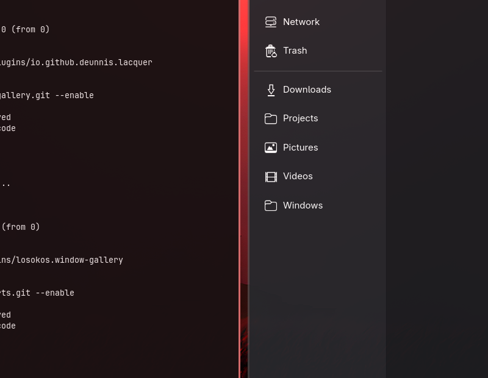

# Task switcher for Omarchy

A keyboard-driven window switcher for [Omarchy](https://omarchy.org). Hold a
modifier, tap <kbd>Tab</kbd> to walk the windows, release to focus the one you
landed on — with a live preview of the highlighted window and a rail of every
open window underneath it.



## Requirements

- Omarchy on Hyprland, current release (the Lua-based `hypr/*.lua` config and
  `hl.dsp` dispatchers)
- Quickshell, as shipped with Omarchy

## Install

```bash
git clone https://github.com/nayan/omarchy-task-switcher.git
cd omarchy-task-switcher
./install.sh
```

`install.sh` copies the plugin into `~/.config/omarchy/plugins/`, registers it in
`~/.config/omarchy/shell.json`, writes the keybindings into
`~/.config/hypr/bindings.lua` between marker comments, and restarts the shell.
Both edited files are backed up once as `<file>.bak-<timestamp>`, and re-running
the installer is safe.

To remove it again:

```bash
./uninstall.sh
```

## Keys

| Shortcut | Does |
| --- | --- |
| <kbd>Alt</kbd> + <kbd>Tab</kbd> | Cycle windows on the current workspace |
| <kbd>Alt</kbd> + <kbd>Shift</kbd> + <kbd>Tab</kbd> | Same, backwards |
| <kbd>Super</kbd> + <kbd>Tab</kbd> | Cycle windows across every workspace |
| <kbd>Super</kbd> + <kbd>Shift</kbd> + <kbd>Tab</kbd> | Same, backwards |
| <kbd>Super</kbd> + <kbd>Alt</kbd> + <kbd>Tab</kbd> | Cycle windows grouped by workspace |
| <kbd>Super</kbd> + <kbd>Alt</kbd> + <kbd>Shift</kbd> + <kbd>Tab</kbd> | Same, backwards |
| <kbd>1</kbd>–<kbd>9</kbd> | Jump straight to a window |
| <kbd>Esc</kbd> | Close without focusing |

Release the modifier to focus the highlighted window. The default Omarchy
<kbd>Tab</kbd> switcher bindings are unbound by the installer, so the two do not
fight.

## How it looks

Sizes are authored against a 1536×864 reference display and scaled to whatever
screen the panel opens on, from a 1280×720 laptop up to 4K, with the panel width
capped so it never runs off the edge. Colours come from the active Omarchy
theme, so it follows light and dark themes and theme changes without any
configuration.

## Layout

```
plugin/
  TaskSwitcher.qml      state machine, shortcuts, the overlay surface
  SwitcherView.qml      panel, header, window rail, responsive sizing
  HeroPreview.qml       live screencapture preview of the selection
  WindowRow.qml         one window in the rail
  KeyCap.qml            the hint chips in the footer
  TaskSwitcherLogic.js  entry building, grouping, rail layout
  manifest.json         plugin registration
hypr/
  task-switcher-binds.lua   the keybindings install.sh injects
install.sh / uninstall.sh
```

## Notes

- The active window is marked with a dot in grouped mode, where it is not
  always the first entry.
- The rail scrolls sideways once there are more windows than fit.
- The preview is a real screencapture of the window, so it shows the window as
  it currently is, live.

## License

MIT — see [LICENSE](LICENSE).
